## Домашнее задание к занятию «Инструменты Git» FOPS-38 Щербатых А.Е.
### Задание
Склонируйте [репозиторий](https://github.com/hashicorp/terraform) с исходным кодом Terraform.
Создайте файл для ответов на задания в своём репозитории, после выполнения прикрепите ссылку на .md-файл с ответами в личном кабинете.
В клонированном репозитории:

1. Найдите полный хеш и комментарий коммита, хеш которого начинается на aefea.

2. Ответьте на вопросы:

- Какому тегу соответствует коммит 85024d3?
- Сколько родителей у коммита b8d720? Напишите их хеши.
- Перечислите хеши и комментарии всех коммитов, которые были сделаны между тегами v0.12.23 и v0.12.24.
- Найдите коммит, в котором была создана функция func providerSource, её определение в коде выглядит так: func providerSource(...) (вместо троеточия перечислены аргументы).
- Найдите все коммиты, в которых была изменена функция globalPluginDirs.
- Кто автор функции synchronizedWriters?
  
***В качестве решения ответьте на вопросы и опишите, как были получены эти ответы.*

____________________________________________________________________________________

### Решение

**Задание 1**

Склонировал репозиторий с исходным кодом Terraform. Создал репозиторий для отчета по заданию.

С помощью команд ```git show aefea``` и ```git log aefea``` ищу полный хеш и комментарий коммита, хеш которого начинается на aefea:

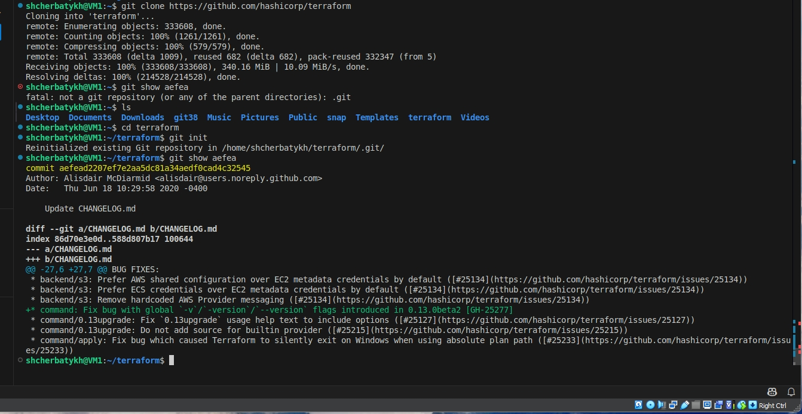

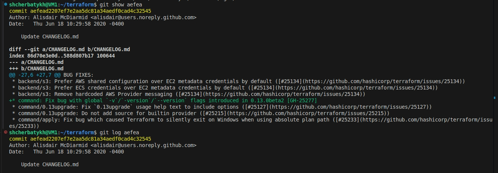

Вижу, что полный хеш коммита в обоих случаях *aefead2207ef7e2aa5dc81a34aedf0cad4c32545* и комментарий к коммиту ```"Update CHANGELOG.md"```.

Команда ```git show``` в первую очередь нужна для отображения какого-либо одного коммита. Она отображает подробные данные коммита, включая весь ```diff```. Также команда может отображать не закоммиченные объекты.

Команда ```git log``` нужна для отображения диапазона коммитов. По умолчанию выводит только хеш коммита, автора и комментарий к коммиту, тег коммита.

При необходимости вывод можно сократить командой ```git log aefea --pretty=oneline```:

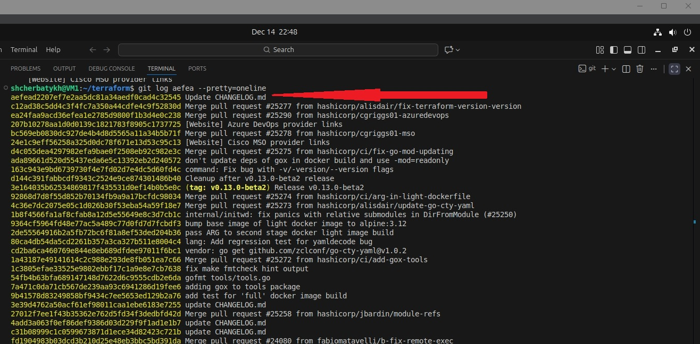

**Задание 2**

Ответы на вопросы:

- Какому тегу соответствует коммит 85024d3?

Смотрю вывод команды git log 85024d3 --oneline и вижу, что коммиту ```85024d3``` соответствует тег ```tag: v0.12.23```

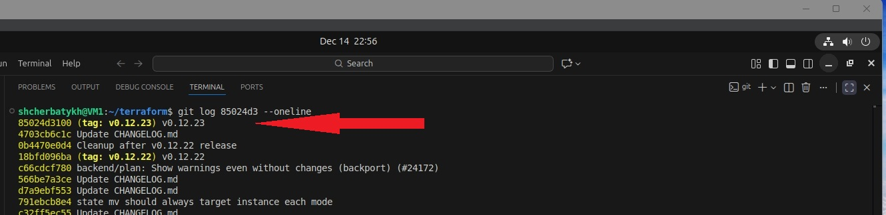

Можно сделать наоборот, проверить какой коммит соответствует тегу v0.12.23. Можно проверить командами ```git show v0.12.23``` или ```git log v0.12.23```.

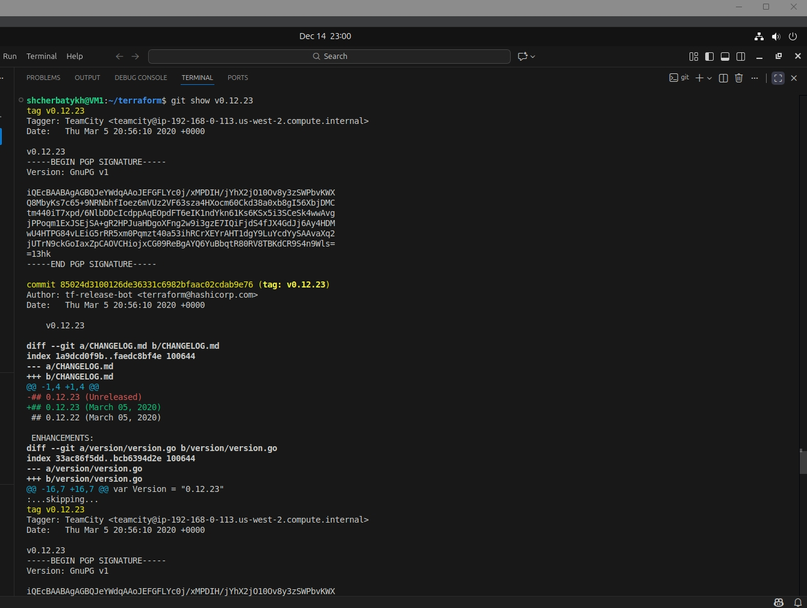

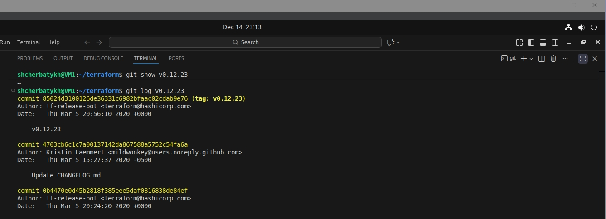

```git show v0.12.23``` покажет более полную информацию, где видно того, кто создал тег, дату создания, хеш коммита и сам коммит, цифровую подпись коммита и диффы.

- Сколько родителей у коммита b8d720? Напишите их хеши.
  
Проверяю вывод команды ```git log b8d720 --pretty=format:'%h %s' --graph``` и вижу, что коммит ```b8d720``` это мерж коммит и у него 2 родителя:

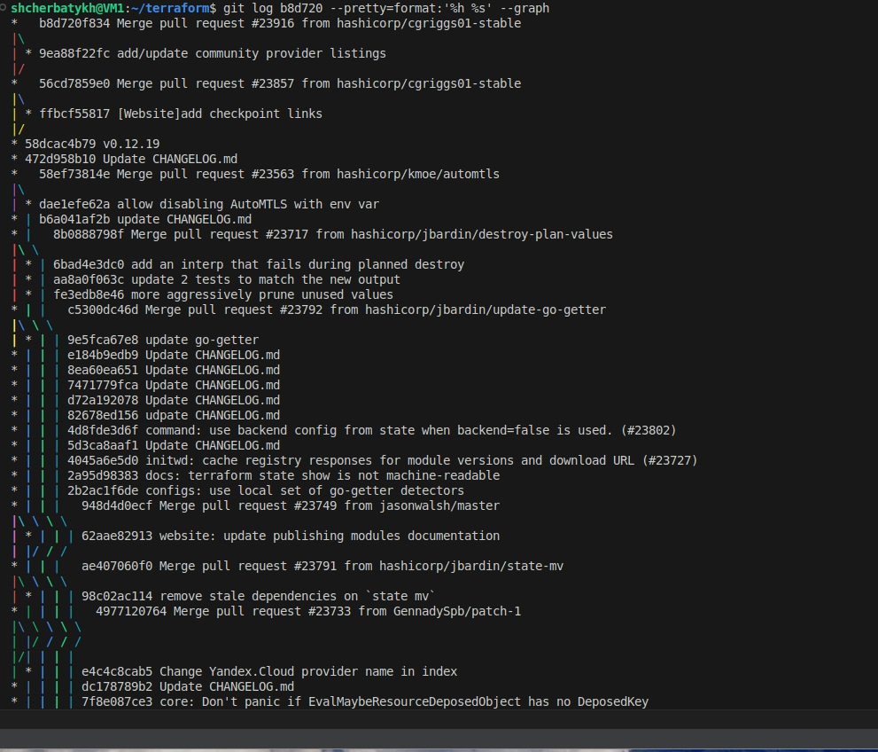

Проверяю первого родителя командой ```git show b8d720^1``` и вижу результат:

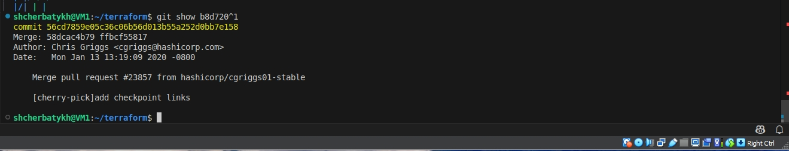

Проверяю второго родителя командой ```git show b8d720^2``` и вижу результат:

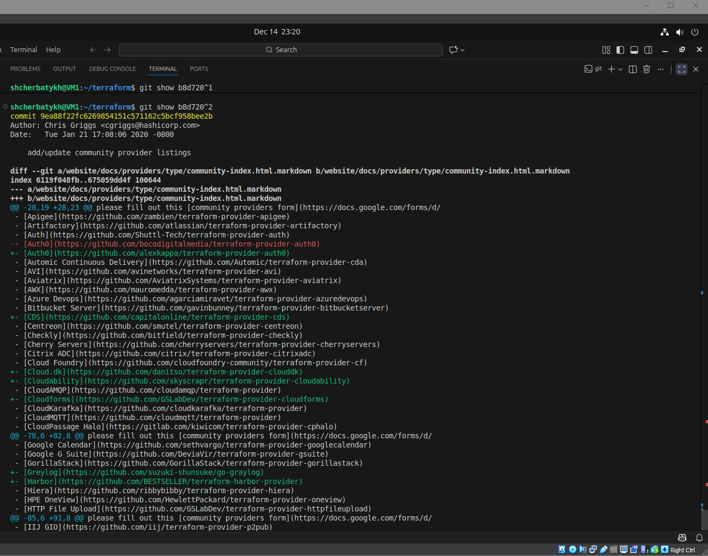

Пытаюсь проверить третьего родителя командой ```git show b8d720^3``` и вижу, что третьего родителя не существует:

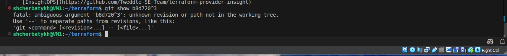

Хеши родителей коммита ```b8d720```: 

Родитель 1 - 56cd7859e05c36c06b56d013b55a252d0bb7e158

Родитель 2 - 9ea88f22fc6269854151c571162c5bcf958bee2b

- Перечислите хеши и комментарии всех коммитов, которые были сделаны между тегами v0.12.23 и v0.12.24.
  
Командой ```git log v0.12.23..v0.12.24 --oneline``` выводим коммиты которых нет в теге v0.12.23, но есть в теге v0.12.24:

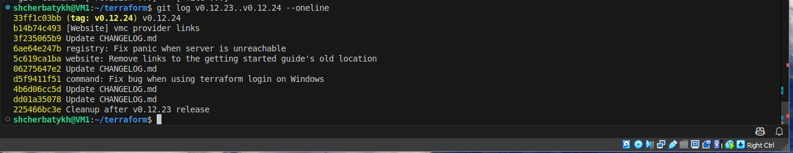

Между тегами v0.12.23 и v0.12.24 было сделано 9 коммитов.

- Найдите коммит, в котором была создана функция ```func providerSource```, её определение в коде выглядит так: ```func providerSource(...)``` (вместо троеточия перечислены аргументы).

Выполняю поиск командой ```git log -S 'func providerSource(' --oneline```

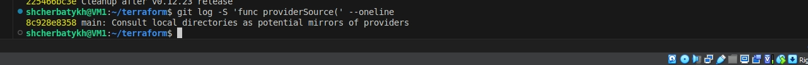

Видно, что функция была создана в коммите с хешем *8c928e8358* либо полным хешем *8c928e83589d90a031f811fae52a81be7153e82f*

- Найдите все коммиты, в которых была изменена функция ```globalPluginDirs```.

Сначала командой ```git grep -p 'globalPluginDirs'``` найду в каких файлах репозитория есть функция ```globalPluginDirs```

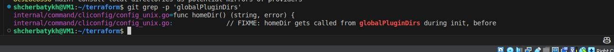

Видим, что функция ```globalPluginDirs``` есть в файле **config_unix.go**

Проверяю, менялась ли функция ```globalPluginDirs```.

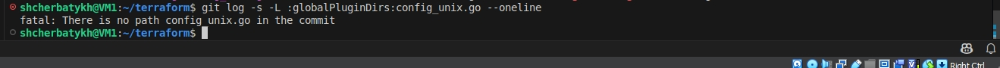

Коммиты не найдены

- Кто автор функции ```synchronizedWriters```?

Командой ```git log -S 'synchronizedWriters'``` смотрю коммиты, в котором была создана функция synchronizedWriters

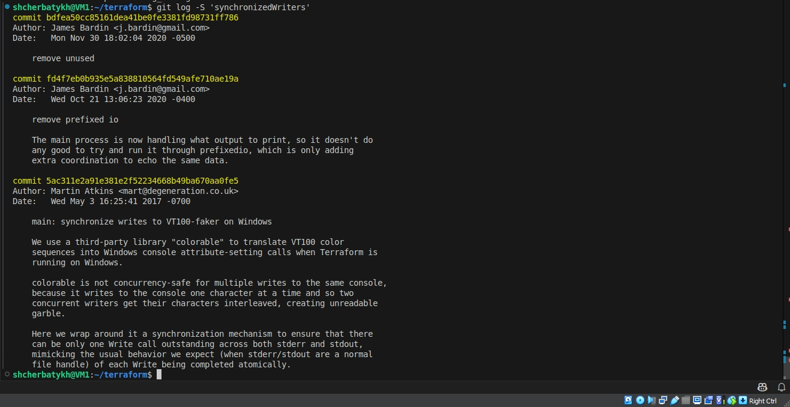

Есть три коммита с такой функцией, но самый ранний коммит с хешем *5ac311e2a91e381e2f52234668b49ba670aa0fe5* создан автором Martin Atkins [mart@degeneration.co.uk](mart@degeneration.co.uk)

Значит автором коммита является Martin Atkins.
